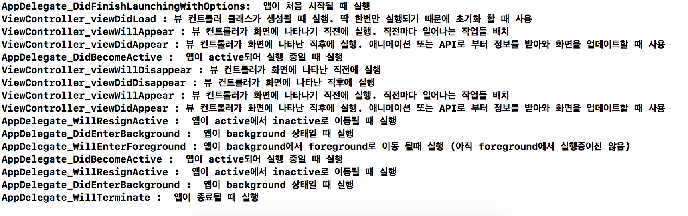

# iOS_Study
# LifeCycle 정리

생명주기에는 앱 생명주기(App LifeCycle)와 뷰 컨트롤러 생명주기(ViewController LifeCycle)이 있다.<br><br><br>

## 앱 생명주기 (App LifeCycle)
앱 생명주기는 앱의 background 또는 foreground 등과 같은 상태들을 정의한 것이다. <br>
AppDelegate.swift에 작성한다.<br>

```  
    func application(_ application: UIApplication, didFinishLaunchingWithOptions launchOptions: [UIApplication.LaunchOptionsKey: Any]?) -> Bool {
       print("AppDelegate_DidFinishLaunchingWithOptions:  앱이 처음 시작될 때 실행")
       return true
    }
    
    func applicationWillResignActive(_ application: UIApplication) {
       print("AppDelegate_WillResignActive :  앱이 active에서 inactive로 이동될 때 실행")
    }
    
    func applicationDidEnterBackground(_ application: UIApplication) {
        print("AppDelegate_DidEnterBackground :  앱이 background 상태일 때 실행")
    }

    func applicationWillEnterForeground(_ application: UIApplication) {
        print("AppDelegate_WillEnterForeground : 앱이 background에서 foreground로 이동 될때 실행 (아직 foreground에서 실행중이진 않음)")
    }

    func applicationDidBecomeActive(_ application: UIApplication) {
        print("AppDelegate_DidBecomeActive :  앱이 active되어 실행 중일 때 실행")
    }

    func applicationWillTerminate(_ application: UIApplication) {
        print("AppDelegate_WillTerminate :  앱이 종료될 때 실행")
    }
```
<br><br><br>
## 뷰 컨트롤러 생명주기 (ViewController LifeCycle)
뷰 컨트롤러 생명주기는 앱의 한 화면이 다른 화면으로 전환될 때의 상태들을 정의한 것이다. <br>
ViewController.swift에 작성한다.<br>

```
    override func viewDidLoad() {
        super.viewDidLoad()
        print("ViewController_viewDidLoad : 뷰 컨트롤러 클래스가 생성될 때 실행. 딱 한번만 실행되기 때문에 초기화 할 때 사용")
    }

    override func viewWillAppear(_ animated: Bool) {
        print("ViewController_viewWillAppear : 뷰 컨트롤러가 화면에 나타나기 직전에 실행. 직전마다 일어나는 작업들 배치")
    }
    
    override func viewDidAppear(_ animated: Bool) {
        print("ViewController_viewDidAppear : 뷰 컨트롤러가 화면에 나타난 직후에 실행. 애니메이션 또는 API로 부터 정보를 받아와 화면을 업데이트할 때 사용")
    }
    
    override func viewWillDisappear(_ animated: Bool) {
        print("ViewController_viewWillDisappear : 뷰 컨트롤러가 화면에 나타난 직전에 실행")
    }

    override func viewDidDisappear(_ animated: Bool) {
        print("ViewController_viewDidDisappear : 뷰 컨트롤러가 화면에 나타난 직후에 실행")
    }

```
<br><br><br>
## 앱 실행시 호출 순서
생명주기들의 호출 순서를 알아보기 위해 다음과 같은 화면을 구성하였다. <br>

  <br><br>

앱 실행 순서는 다음과 같다. <br>
1. 앱 실행<br>
2. NextView 버튼 클릭하여 파란색 뷰로 화면전환<br>
3. Back 클릭해 이전 뷰로 화면전환<br>
4. 홈버튼 클릭하여 앱을 background상태로 전환<br>
5. 앱을 다시 실행<br>
6. 앱 종료<br><br>

위와 같은 순서에 따라 실행하였을 때 콘솔에 출력되는 결과는 다음 이미지와 같다.<br>

